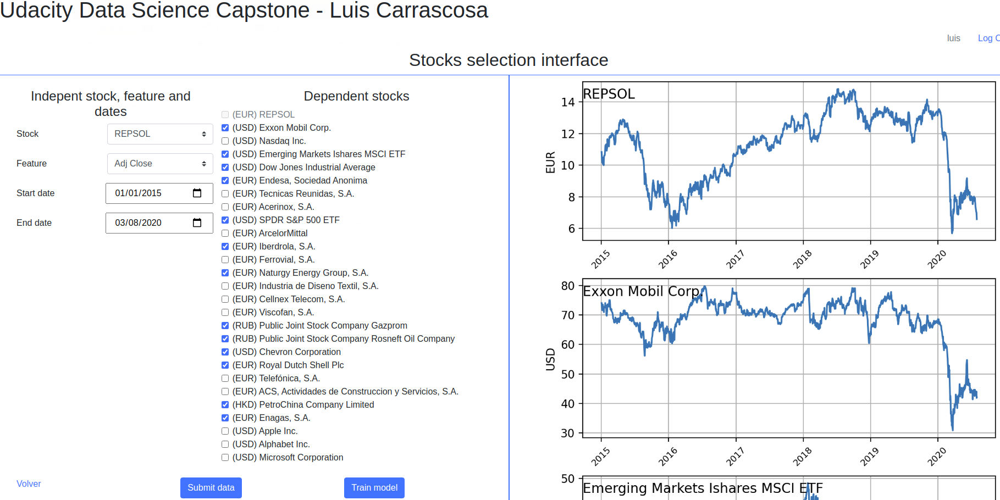
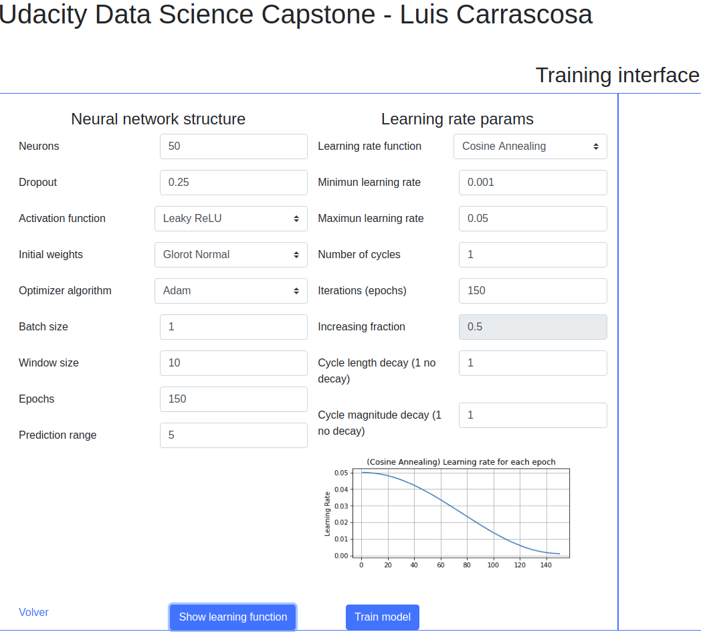
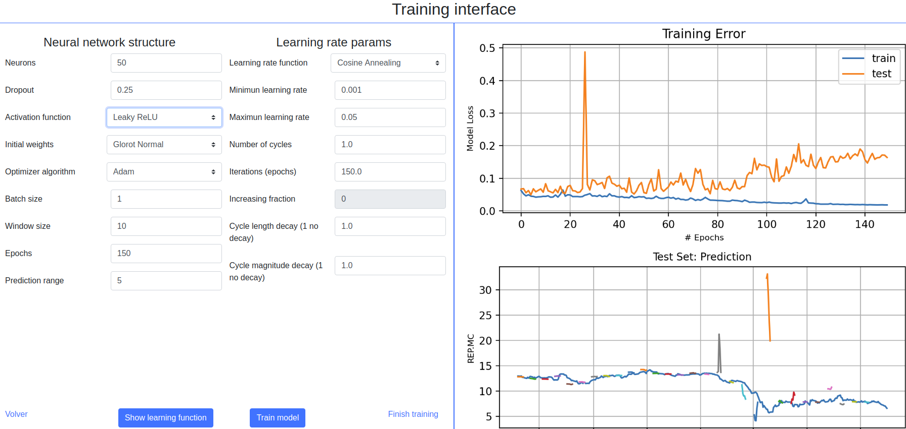
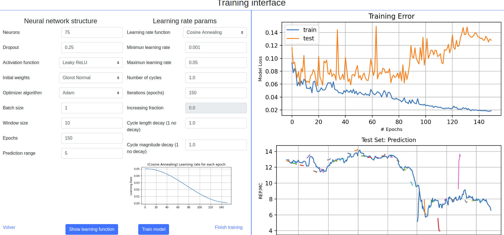
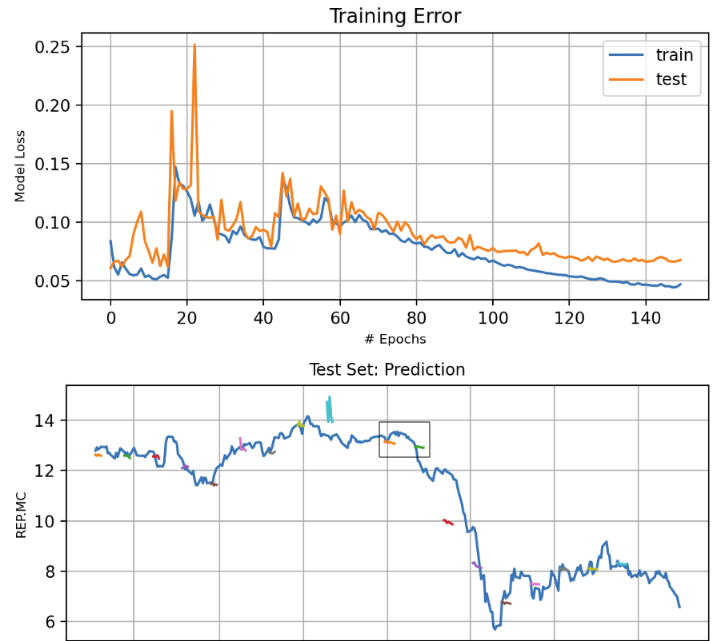
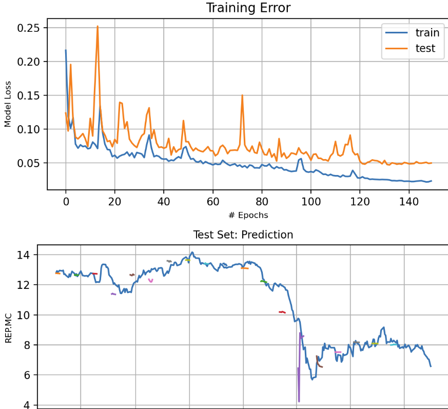
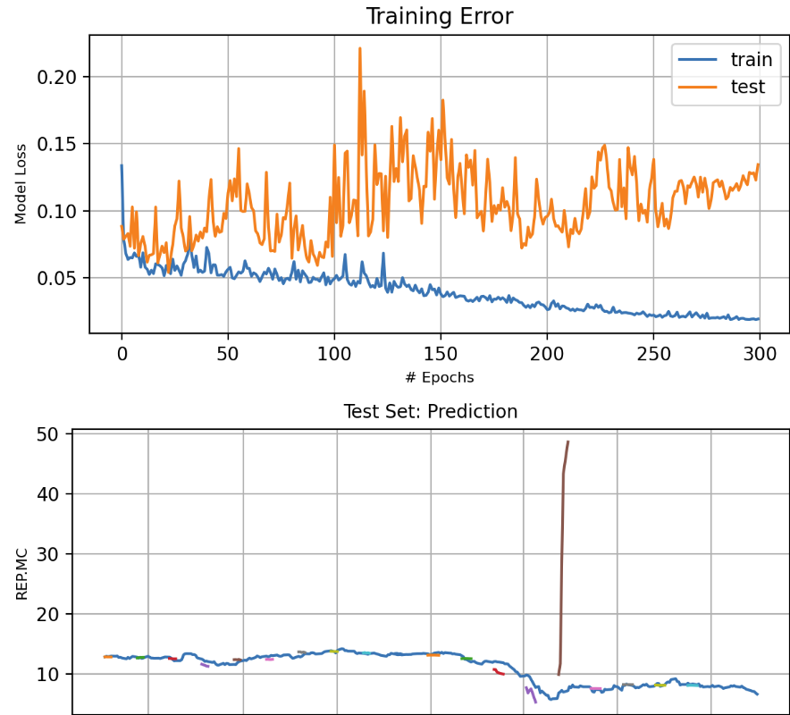
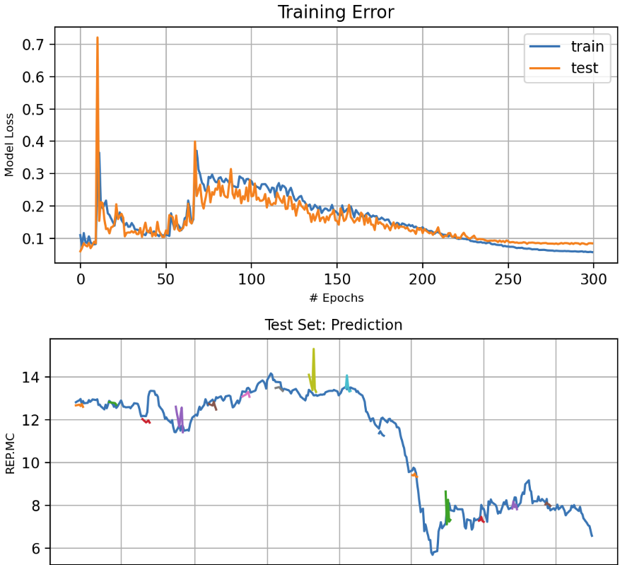
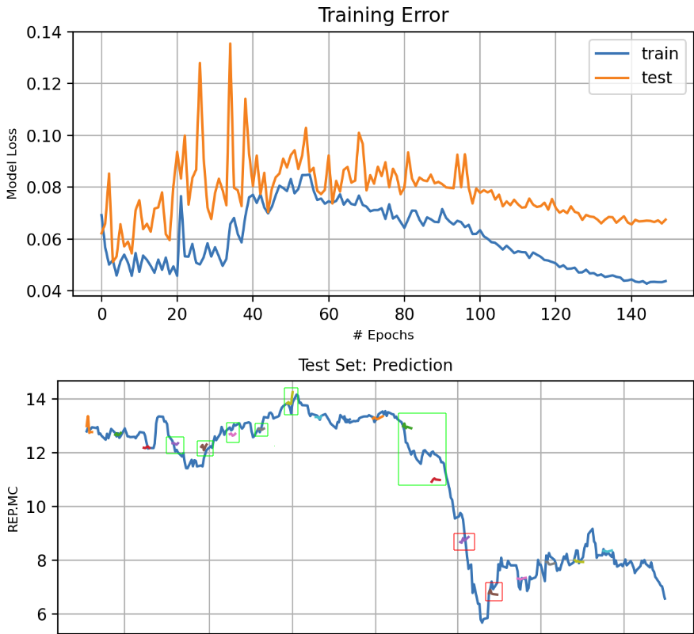
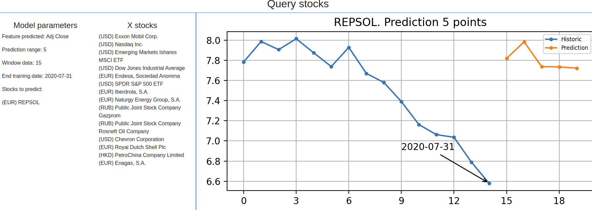

# udacity-ds-nanodegree-capstone
## luis.carrascosa.next@bbva.com
## Project definition
### Project Overview
In this project we want to provide a web interface that allows:
- Acquisition of data on company quotes, funds or stock exchange indexes
- Training of a LSTM model
- Predicting product quotes

Flask is used on a SQLite database. Bootstrap is used for the layout.

Stocks prices are obtained from [yahoo finance](https://es.finance.yahoo.com/), downloading the csvs and storing them in the database

### Project Statement
The problem to be solved is the prediction of the prices of a stock. LSTM will be used for this purpose, taking as inputs:
- past prices of the stock
- technical value indicators of the stock
- past prices of stocks related to the target

After the training of the model, the predictions will be shown against the last stock prices. In case more recent data have been obtained since the model was trained, they will also be shown to compare every day how reality evolves against the prediction.

It is expected that, although the predictions are not completely accurate, if we are able to anticipate trends that advise purchases or sales of shares of the target stock market value.

As a stock portfolio cannot have a single value, it is allowed that there are several models with different target values with their corresponding related values.

### Metrics
The MAE (Mean Absolute Error) metric is used during the training of the model to decide whether to keep or re-training the model by changing some parameter of the model (neurons, epochs, etc)

## Analysis
### Data Exploration
The stocks prices are from different markets, so there may be days left for some stocks because the corresponding stock exchange is closed. Therefore, in order not to lose data, the null values are overwritten with the last value. For example, if we have 3 values A, B and C, with the following data:

5-ago: A (100)  B (200)     C (300)
6-ago: A (101)  B (None)    C (301)
7-ago: A (102)  B (202)     C (302)

The value "None" of B of the 6th August is replaced by the previous value of the 5th August, thus
5-ago: A (100)  B (200)     C (300)
6-ago: A (101)  B (200)     C (301)
7-ago: A (102)  B (202)     C (302)

Investors who make their purchases or sales on the 6th payment in case they take into account the value of B on that day will take the last value as a reference.

### Data Visualization
It is important that the selected stocks have data from the start date considered to the end date. The null processing described in the previous section it's limited to one value. If two stocks start from different dates, only data from the most recent start date will be taken.

In addition, there must be a sufficient data at the start of the chosen sample. Otherwise the calculated technical indicators will be invalid, having the same effect os data losses.

Therefore, in the screen for selecting stocks and selecting dates, the data for each chosen stocks is shown. It is recommended to adjust the start date so that all the stocks of interest have data, which can be easily seen with the graphs shown by the application.

## Methodology
### Data Preprocessing
Null values are overwritten with the last value. Only one value. If a market is closed the investors will use the last value for their analysis.
If two stocks start from different dates, only data from the most recent start date will be taken.

If a stock ends before the end date the final data of the other stocks would be lost. In these cases the unlisted stock should no longer be considered for analysis and removed from the application.

### Refinement
It's possible to select other params for the algorithm in the "Training interface" to get the best model possible. However, it is necessary to retrain the model as time passes and we have more data.

## Results
### Model Evaluation and Validation
The parameters model can be adjusted in the "Training interface".

In the screenshot are the best parameters I could get. However you can choose others:
- Neural network structure
  - Neurons
  - Dropout
  - Activation function
    - Tanh
    - ReLU
    - Leaky ReLU
    - Swish
  - Initial weights
    - Zeros
    - Ones
    - Random Normal
    - Glorot Normal
    - Glorot Uniform
  - Optimizer algorithm
    - SGD
    - RMSprop
    - Adam
    - Adamax
    - Ftrl
  - Batch size
  - Window size
  - Epochs
  - Prediction range
- Learning rate params
  - Learning rate function
    - Triangular
    - Cosinne
  - Minimun/Maximun learning rate
  - Number of cycles
  - Epochs
  - Increasing function (only to triangular)
  - Cycle length decay
  - Cycle magnitude decay

With the "Show learning function" you can see the learning function defined by the params.

### Justification
I selected "Repsol" for the stock to predict along with other related stocks:
- (USD) Exxon Mobil Corp.
- (USD) Nasdaq Inc.
- (USD) Emerging Markets Ishares MSCI ETF
- (USD) Dow Jones Industrial Average
- (EUR) Endesa, Sociedad Anonima
- (USD) SPDR S&P 500 ETF
- (EUR) Iberdrola, S.A.
- (EUR) Naturgy Energy Group, S.A.
- (RUB) Public Joint Stock Company Gazprom
- (RUB) Public Joint Stock Company Rosneft Oil Company
- (USD) Chevron Corporation
- (EUR) Royal Dutch Shell Plc
- (HKD) PetroChina Company Limited
- (EUR) Enagas, S.A.

Other user can do a different analisys. There is a user managment in the initial appliation view. You can register as a new user or login. Every user will have their separate models in the database. 

With "Submit data" you can see the data of every stock selected. You can scroll at the right to see all stocks.

"Train model" gives access to the training interface. We can select the desired params, train, view the results, change some params and retrain the model as many times as we wish.

> 50 neurons, 150 epochs, Leaky Relu, Glorot Normal, Adam, Window size 10, Prediction 5 
> Cosine function. [0.001, 0.05] 
> There is overfitting and outliers in the predictions over the test data 

> (increase) 75 neurons, 150 epochs, Leaky Relu, Glorot Normal, Adam, Window size 10, Prediction 5 
> Cosine function. [0.001, 0.05] 
> Overfitting get worse 

> 50 neurons, 150 epochs, Leaky Relu, Glorot Normal, Adam, (increase) Window size 15, Prediction 5 
> Cosine function. [0.001, 0.05] 
> There is no overfitting. I like the two predictions before the fall caused by the COVID-19 

> (increase) 100 neurons, 150 epochs, Leaky Relu, Glorot Normal, Adam, (increase) Window size 15, Prediction 5 
> Cosine function. [0.001, 0.05] 
> It seems that to prevent overfitting by increasing the number of neurons the window size should be increased. The prediction of fall by the COVID still appears, but it is less clear 

> (increase) 100 neurons, (increase) 300 epochs, Leaky Relu, Glorot Normal, Adam, (increase) Window size 15, Prediction 5 
> Cosine function. [0.001, 0.05] 
> Overfitting explodes again 

> (increase) 100 neurons, (increase) 300 epochs, Leaky Relu, Glorot Normal, Adam, (increase more) Window size 20, Prediction 5 
> Cosine function. [0.001, 0.05] 
> Again, we can see that if we increase the window size the overfitting is corrected. But the predictions have too many outliers 

> 50 neurons, (decrease) 100 epochs, Leaky Relu, Glorot Normal, Adam, (increase) Window size 15, Prediction 5 
> Cosine function. [0.001, 0.05] 
> There is no overfitting. There are predictions that I like (in green) and others that I don't (in red) 
> THIS will be our model 

With "Finish training" we return to the main page. If we click in "Query stocks" we'll have predictions from the day the model was created to the present. If new quote data has been acquired it will appear in the prediction's graph so that we can compare. the date in the graph it's the present date.

## Conclusion
### Reflection
Switching from a Jupyter notebook to a web application has been expensive but the final result has left me satisfied. The usability as a product that provides an application surpasses that of the notebook, although the previous design work of the model it's faster in Jupyter.

Besides, it is a product (the web application) that makes me want to keep evolving and improving.

Regarding the modeling and prediction made on Repsol presented in this project, I was pleasantly surprised to obtain models that, before the great fall caused by the COVID-19, have predicted such fall. This is possible because we do not only treat the data of the target company (Repsol), but of others in the same sector (among them a Chinese one)

I would very much like to add text analysis to get information from the news and use it in the model, but I haven't had time to do that. Besides, I don't know if there are daily and category news repositories as well as APIs that provide stock prices.

### Improvement
There are many improves:
- Usability
  - Include stocks managment
  - Group stocks by sectors
  - Stock portfolio managment
- Presentation
  - Best layout and web design
- Model
  - Experiment with more hidden layers
  - Adding sentiment analisys to
    - finantial news
    - general news (detect COVID in news, for example)
  - Add technical indicators to X-stocks
  - Predicting trends rather than focusing on exact values

## Deliverables
The web application can run in local or in a Docker container. Checkout the code from the [Github repo](https://github.com/LuisCarrascosa/udacity-ds-nanodegree-capstone) and execute:

> docker-compose up 

in the github directory. It's necessary to have docker and docker-compose installed.
Register and login to use the application.